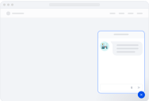

# Docusaurus Plugin Dify Chatbot

[Dify App Embedding In Websites](https://docs.dify.ai/guides/application-publishing/embedding-in-websites) plugin for Docusaurus.

## Dify Chatbot



## Installation

```bash
npm install docusaurus-plugin-dify-chatbot
```


## Usage

In your `docusaurus.config.js`:

```javascript
  plugins: [
    'docusaurus-plugin-dify-chatbot',
    {
      // Required, automatically generated by Dify
      token: 'YOUR_TOKEN',
      // Optional, default is false
      isDev: false,
      // Optional, when isDev is true, default is 'https://dev.udify.app', otherwise default is 'https://udify.app'
      baseUrl: 'YOUR_BASE_URL',
      // Optional, It can accept any valid HTMLElement attribute other than `id`, such as `style`, `className`, etc
      containerProps: {},
      // Optional, If or not the button is allowed to be dragged, default is `false`
      draggable: false,
      // Optional, The axis along which the button is allowed to be dragged, default is `both`, can be `x`, `y`, `both`
      dragAxis: 'both',
      // Optional, An object of inputs that set in the dify chatbot
      inputs: {
          // key is the variable name
          // e.g.
          // name: "NAME"
      },
	  
      // Overriding Default Button Styles
	    bubbleButtonStyle: 'background-color: #1C64F2 !important;',
    },
  ],
```

## License

MIT
